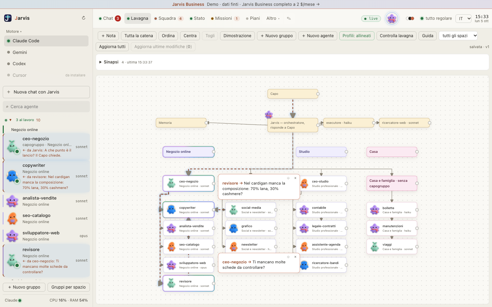
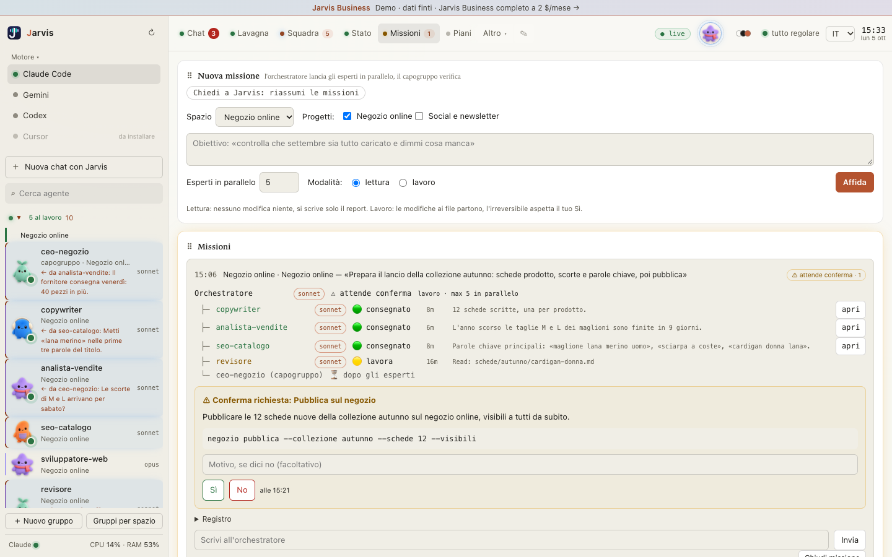
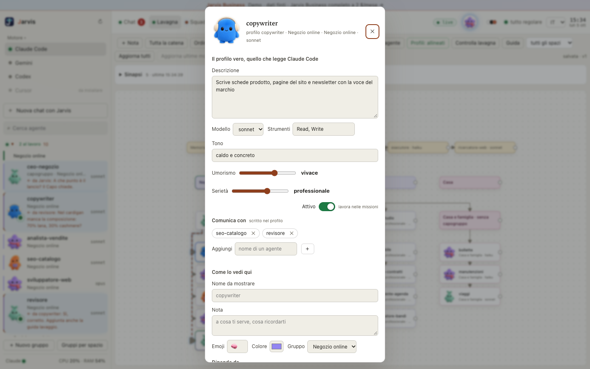

# Jarvis Business · Demo

Il pannello di controllo di **Jarvis Business**, con dati finti. Lo provi nel browser: niente da installare, niente account, niente dati tuoi.

Jarvis è il braccio destro che lavora sul tuo computer con Claude Code. Divide il lavoro fra una squadra di agenti, uno per ogni mestiere (capogruppo, copywriter, analista, revisore…), ricorda tutto in una memoria sua e prima di cancellare, pubblicare o pagare ti chiede il sì.

## Provala

- **Online:** https://jarvis-business-it.github.io/Jarvis-Demo/
- **Sul tuo computer:** in alto su GitHub scegli **Code → Download ZIP**, scompatta e fai doppio clic su `index.html`. Funziona anche senza internet.

Il cliente di prova si chiama Mario Rossi e ha tre spazi di lavoro: Negozio online, Studio e Casa. Clicca pure dappertutto: tiri e togli i fili sulla lavagna, sposti le schede, apri il profilo di un agente, affidi una missione e guardi la squadra lavorare, rispondi Sì o No a una conferma, chiudi le scadenze. Il pannello è in italiano, inglese, spagnolo, francese e tedesco (in alto a destra). Dalla 0.6 è uguale al Jarvis che usiamo noi ogni giorno: cinque temi (Scuro, Nero, Chiaro, Claude, Automatico, dai pallini colorati in alto), gli agenti con le mascotte Dots, la barra delle pagine che ordini tu, la chat a schede con le Notifiche, i Piani da approvare e le Connessioni. Prova anche dal telefono: le pagine stanno in una barra in basso.

| La missione chiede il tuo sì | Il profilo di un agente |
|---|---|
|  |  |

## Cosa c'è qui e cosa no

Qui c'è la pagina vera del pannello, uguale a quella del prodotto. Le immagini delle mascotte Dots vengono da [OpenDots](https://github.com/CopilotKit/OpenDots) (licenza MIT, «Copyright (c) Atai Barkai», testo in `demo/dots/LICENSE-OpenDots.txt`). Al posto del server c'è un server finto (`demo/finto.js`) che risponde con i dati di esempio di `demo/dati/`. Le cose che nel prodotto lavorano davvero (la chat con Claude Code, le telefonate, il server, gli aggiornamenti) nella demo rispondono con un avviso.

Nella versione completa ci sono il server del pannello, gli agenti veri, la memoria, l'installazione guidata su misura e gli aggiornamenti.

## Jarvis Business completo: 2 $ al mese

> **Abbonati su [github.com/sponsors/AndyTrust](https://github.com/sponsors/AndyTrust)** e ricevi l'accesso al repository privato con Jarvis Business: installazione guidata, agenti, memoria, pannello e aggiornamenti.

Puoi abbonarti anche su [patreon.com/ItaloMarziano](https://www.patreon.com/ItaloMarziano), con 7 giorni di prova gratuita.

Se ti serve un server, noi usiamo Hostinger: con [questo link](https://www.hostinger.com/it?REFERRALCODE=ITALOMARZIANO) ci dai una mano a mantenere il progetto e a te non costa niente in più (è un link di affiliazione).

Questa demo è coperta da [LICENSE](LICENSE): puoi provarla, non ridistribuirla.
