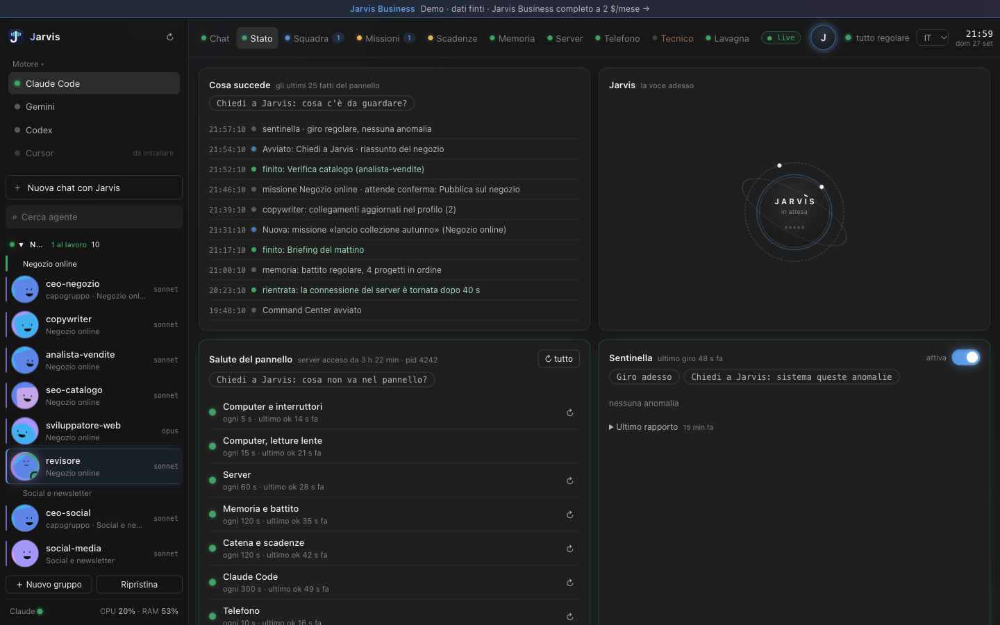
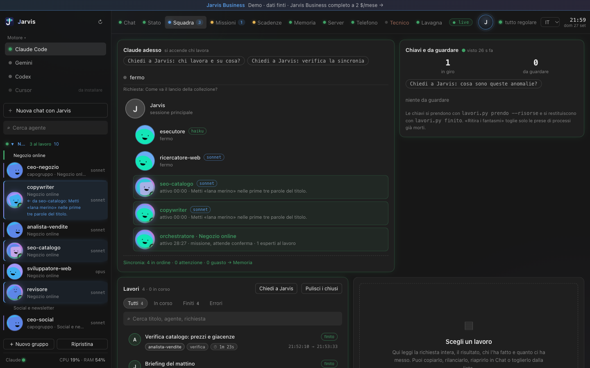
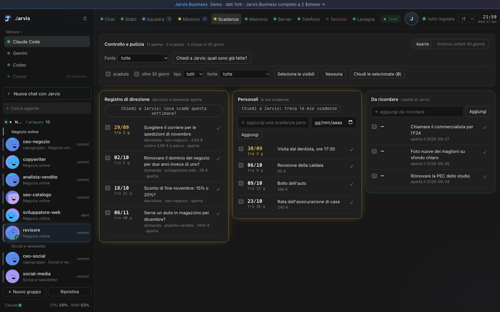

# Cosa fa Jarvis

Jarvis è un assistente personale su Claude Code. Gira sul tuo computer, non su un server nostro. Parli con lui in linguaggio naturale, come lo diresti a una persona: «controlla gli incassi di ieri», «scrivi la risposta a questo cliente», «perché il sito è lento?».

## Un assistente per progetto

Per ogni tuo progetto — un negozio online, uno studio professionale, la gestione della casa — indichi i lavori che ripeti spesso, e l'installazione crea gli specialisti: uno per materia, con il suo compito e la sua memoria. L'assistente è l'unico che parla con te e l'unico che lancia gli altri agenti. Dove un progetto ha più di uno specialista, un capogruppo li coordina e li verifica prima di rispondere a te.

## Il pannello di controllo

Il Command Center è una pagina sul tuo computer, `127.0.0.1:7777`, in italiano, inglese, spagnolo, francese o tedesco. Mostra cosa succede in tempo reale, senza dover riaprire la pagina.

Le pagine principali:

- **Squadra**: chi lavora adesso, i lavori in corso o finiti, gli agenti per progetto.
- **Scadenze**: le tue scadenze personali e le richieste ancora aperte, tutte insieme, solo quello che è aperto.
- **Memoria**: se la memoria di ogni progetto è aggiornata davvero, controllo che va oltre il solo verificare che esista.

## Dal telefono

Il pannello si apre anche dal telefono, sulla stessa rete Wi-Fi di casa, inquadrando un codice QR. Non risponde mai da Internet.

## Autonomia con freni

Jarvis legge, cerca e lavora sui tuoi file senza chiedere permesso a ogni passo. Quello che non si può disfare — cancellare, pubblicare, pagare, mandare messaggi — si ferma e aspetta il tuo sì.
