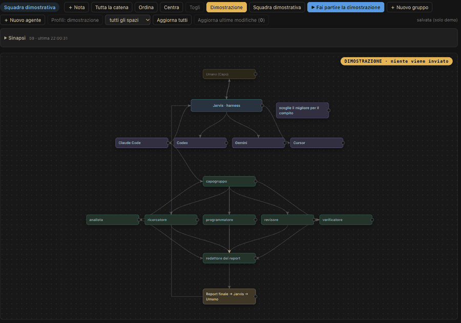

# Guida a Jarvis Business

Jarvis è un assistente personale che gira sul tuo computer, con Claude Code come cervello. Questa guida spiega cosa fa, come tiene gli agenti sotto controllo, come funziona la memoria e quanto costa.

## Le pagine

- [Cosa fa Jarvis](Cosa-fa-Jarvis.md) — l'assistente, il pannello, i tuoi progetti
- [La lavagna](Lavagna.md) — la mappa dei tuoi agenti, in tempo reale
- [Agenti sotto controllo](Agenti-sotto-controllo.md) — verifica, conferme, archivio invece di cancellare
- [Missioni](Missioni.md) — un obiettivo affidato a più agenti insieme
- [Memoria a lungo termine](Memoria-a-lungo-termine.md) — quello che Jarvis non dimentica
- [Pulizia dream](Pulizia-dream.md) — come si tiene ordinata la memoria
- [Installazione](Installazione.md) — come si parte
- [Domande frequenti](Domande-frequenti.md)
- [Prezzo e abbonamento](Prezzo-e-abbonamento.md)

## Prova la demo

Una demo online, senza installare niente: https://jarvis-business-it.github.io/Jarvis-Demo/
