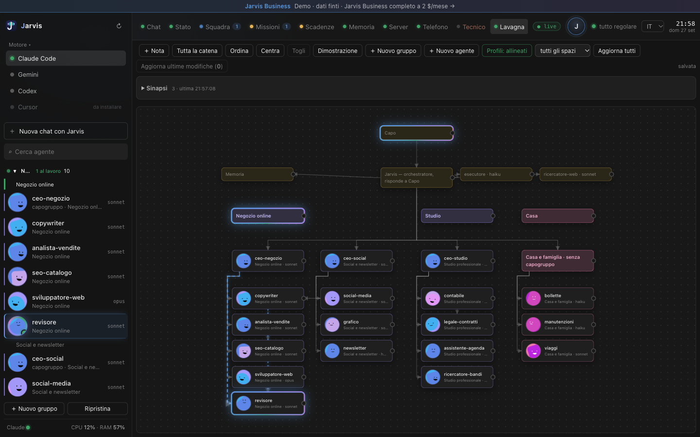
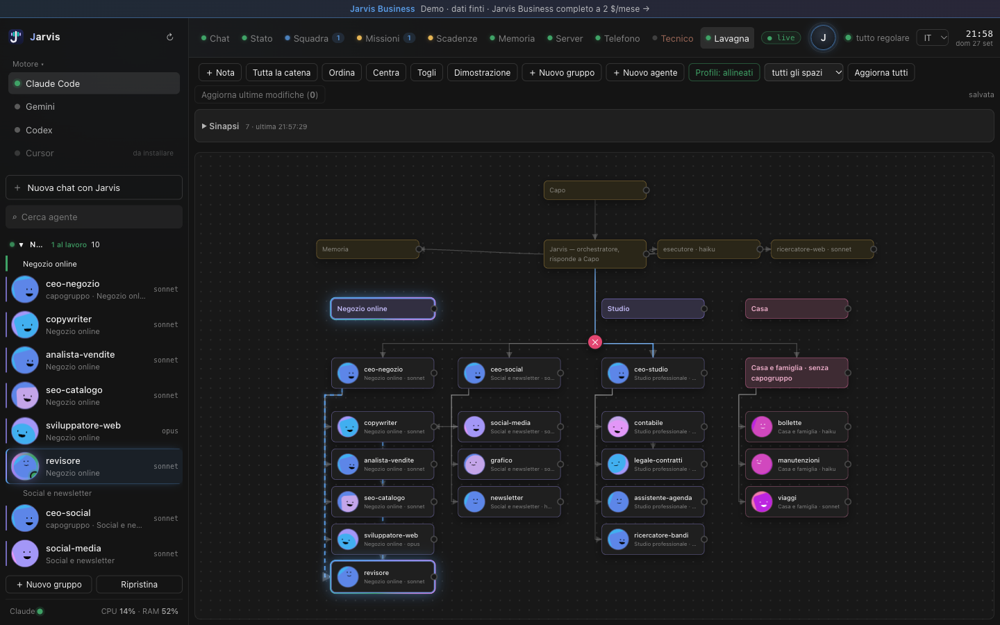
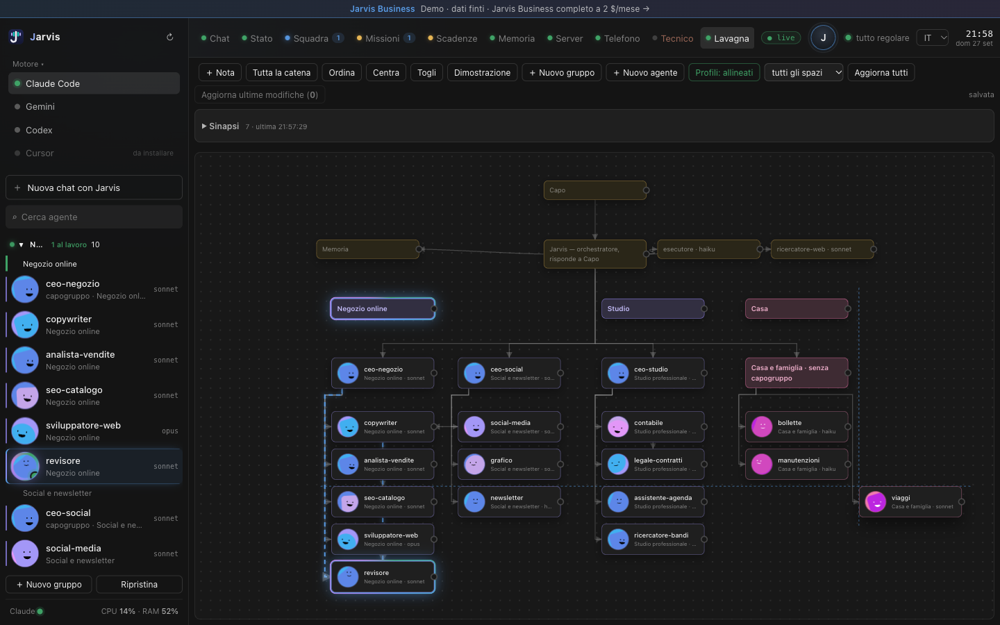

# La lavagna

La lavagna è la mappa dei tuoi agenti. Ogni scheda è un agente, ogni filo è un collegamento: «dipende da», «comunica con». Non è un disegno statico: quando due agenti si parlano davvero, il filo fra loro si accende e scorre nel verso giusto.

## Chi comanda chi

Il bottone «Tutta la catena» costruisce una piramide: tu in cima, il tuo assistente, i capigruppo di ogni progetto, e sotto ognuno la sua squadra di specialisti. Compaiono solo gli agenti che esistono davvero, letti dai loro profili — non un disegno rifatto a mano.

## I fili si accendono

Quando Jarvis lancia un agente, quando uno specialista consegna un lavoro o il capogruppo lo verifica, il filo fra i due si illumina, con una bolla di testo accanto a chi riceve. Rossa se qualcosa è andato storto.

## Il profilo è la fonte di verità

Ogni agente ha un file di profilo vero: descrizione, modello, con chi comunica. La lavagna lo rispecchia, non lo sostituisce. Un badge in alto dice se i profili e la lavagna sono allineati, o quante differenze ci sono: da lì scegli se scrivere la lavagna nei profili o disegnare i profili sulla lavagna.

## Sistemarla è facile

Ogni filo ha una presa larga, facile da cliccare: un clic lo seleziona e mostra una x per toglierlo, un doppio clic lo toglie subito.

Trascinando una scheda, una calamita la aggancia ai bordi e ai centri delle altre, con una guida che si vede mentre sposti.

## Niente si cancella

Un agente che togli non sparisce: va in archivio e si ripristina da lì quando serve. Lo stesso vale per un intero gruppo di agenti.
