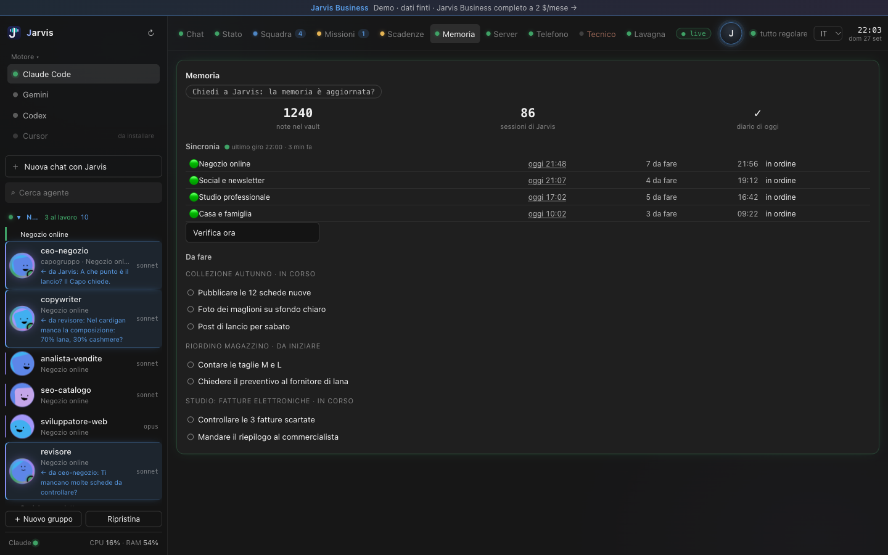

# Memoria a lungo termine

Un assistente che dimentica tutto alla chiusura della chat ti fa ripetere la stessa cosa ogni giorno. Jarvis no: ogni progetto ha la sua memoria, e resta da una sessione all'altra.

## Cosa ricorda

- **Gli errori da non ripetere.** Una strada che sembrava giusta e non lo era, una verifica che ha detto il falso: resta scritta, con il perché e come si evita la prossima volta.
- **Cosa è fatto e cosa resta da fare.** La prima cosa che vedi aprendo una chat su un progetto.
- **Le note collegate.** Se tieni Obsidian, la memoria diventa anche note collegate fra loro, leggibili senza aprire il codice: il profilo del progetto, le decisioni prese, i numeri che contano.

## Un progetto per volta

La memoria di un progetto vive dentro quel progetto e non si mescola con gli altri. Chi apre una chat sul ristorante vede il ristorante, chi apre una chat sul sito vede il sito. Quello che vale per tutti — come scrivi, le tue regole — sta in un posto comune, separato dai dati di ogni progetto.

## Come si aggiorna

A fine giornata dici «salva». Jarvis scrive cosa è stato fatto, cosa resta da fare, e aggiorna le note collegate se tieni Obsidian. Senza questo passaggio, la sessione dopo ricomincerebbe da capo.

## Prima di scrivere una cosa nuova, cerca

Prima di rispiegarti qualcosa che hai già detto, Jarvis cerca nella memoria se esiste già. Non ricomincia da zero, e non scrive due volte la stessa nota.
