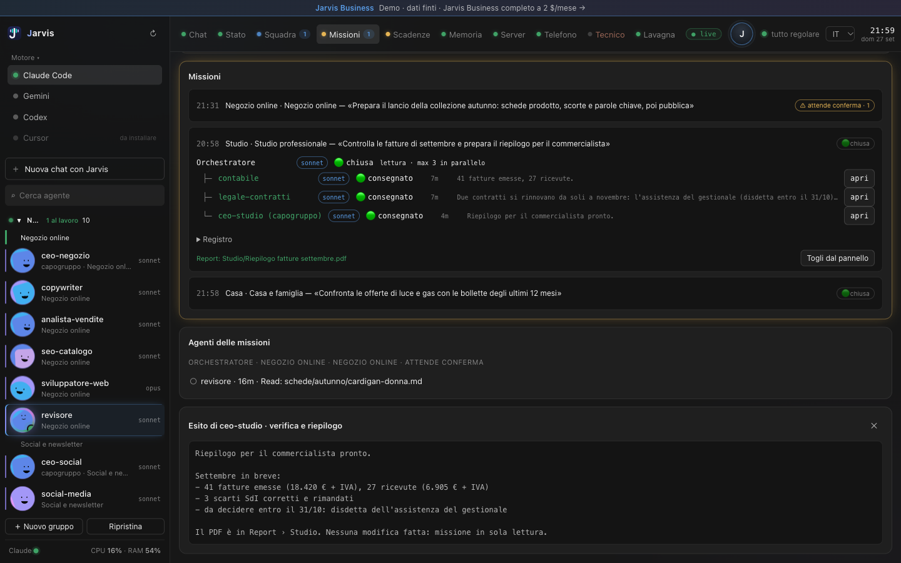

# Missioni

Una missione è un obiettivo affidato a un tuo progetto, o a più progetti insieme. Dentro gira un orchestratore che lancia gli specialisti in parallelo, fino a un tetto che scegli tu, e poi il capogruppo verifica quello che hanno fatto.

## Come si affida

Scegli il gruppo di progetti, scrivi l'obiettivo in poche righe — per esempio «controlla che il mese scorso sia tutto caricato e dimmi cosa manca» — e scegli quanti specialisti al massimo lavorano insieme. Poi scegli il modo:

- **lettura**: nessuno modifica niente, arriva solo il report finale;
- **lavoro**: le modifiche partono davvero, ma tutto quello che non si può disfare si ferma e aspetta il tuo sì.

## Mentre lavora

Puoi mandare un'istruzione nuova senza fermare la missione: l'orchestratore la legge al giro dopo. Le conferme aperte compaiono con il comando esatto sotto gli occhi; senza una tua risposta entro mezz'ora valgono come un no.

## Come finisce

Una missione chiusa scrive un report con cosa è stato fatto. Non resta appesa: se la chiudi, si ferma al controllo successivo e resta visibile per un giorno, poi va in archivio — recuperabile, non cancellato.

Le conferme scadute si chiudono da sole, così una missione non resta in attesa di una risposta che non arriva più.
